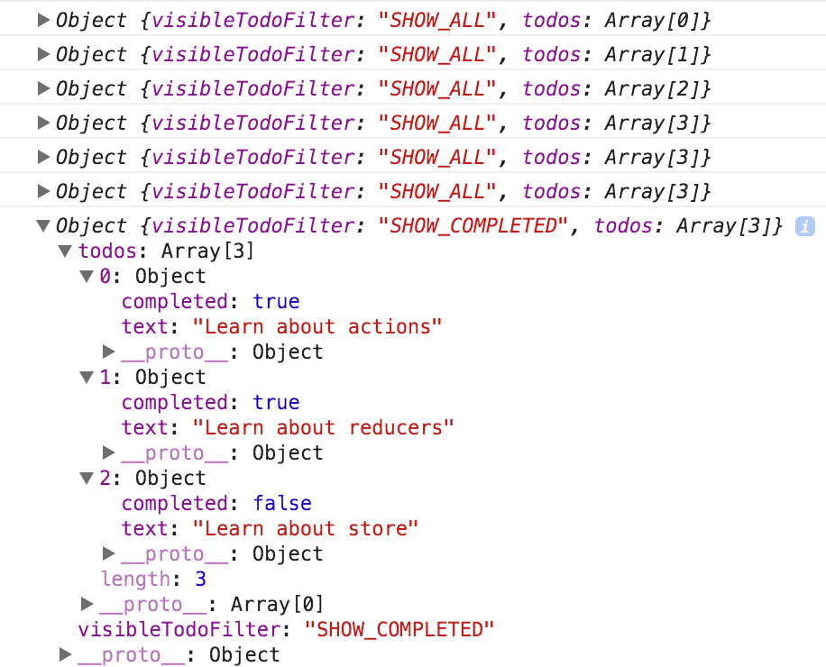

# Store
前のセクションでは、「何が起こったのか」についての事実を表すアクションと、それらのアクションに従って状態を更新するレデューサーを定義しました。

ストアは、それらを結びつけるオブジェクトです。Storeには次の責任があります。

- アプリケーションの状態を保持する
- getState（）で状態へのアクセスを許可する
- ディスパッチ（アクション）を介して状態を更新できるようにする
- サブスクライブ（リスナー）を介してリスナーを登録する
- subscribe（リスナー）によって返された関数を介してリスナーの登録解除を処理する

Reduxアプリケーションには1つのストアしかないことに注意することが重要です。データ処理ロジックを分割したい場合、多くの店舗の代わりにReducerの構成を使用します。

ReducerがあればStoreを作るのは簡単です。前のセクションでは、combinedReducers（）を使用していくつかのReducerを結合しました。これをインポートしてcreateStore（）に渡します。

```javascript
import { createStore } from 'redux'
import todoApp from './reducers'
let store = createStore(todoApp)
```
createStore（）の第2引数として初期状態を指定することもできます。これは、サーバー上で実行されているReduxアプリケーションの状態とクライアントの状態を一致させるために役立ちます。

```javascript
let store = createStore(todoApp, window.STATE_FROM_SERVER)
```

## Dispatching Actions
storeをつくったので、プログラムが動作することを確認しましょう！ UIがなくても、すでに更新ロジックをテストできます。

```javascript
import {
  addTodo,
  toggleTodo,
  setVisibilityFilter,
  VisibilityFilters
} from './actions'

// Log the initial state
console.log(store.getState())

// Every time the state changes, log it
// Note that subscribe() returns a function for unregistering the listener
let unsubscribe = store.subscribe(() =>
  console.log(store.getState())
)

// Dispatch some actions
store.dispatch(addTodo('Learn about actions'))
store.dispatch(addTodo('Learn about reducers'))
store.dispatch(addTodo('Learn about store'))
store.dispatch(toggleTodo(0))
store.dispatch(toggleTodo(1))
store.dispatch(setVisibilityFilter(VisibilityFilters.SHOW_COMPLETED))

// Stop listening to state updates
unsubscribe()
```




私たちはUIの作成を開始する前に、アプリケーションの動作を指定しました。このチュートリアルではこれを行うつもりはありませんが、現時点では、あなたのレデューサーとアクションクリエーターのテストを書くことができます。それらが単なる純粋な機能なので、何かを模倣する必要はありません。Storeにcallし、Storeが返すものにアサーションをする。

## Source Code
### index.js
```javascript
import { createStore } from 'redux'
import todoApp from './reducers'

let store = createStore(todoApp)
```

## Next Steps
todoアプリのUIを作成する前に、Reduxアプリケーションでデータがどのように流れるかを見るために迂回します。


 