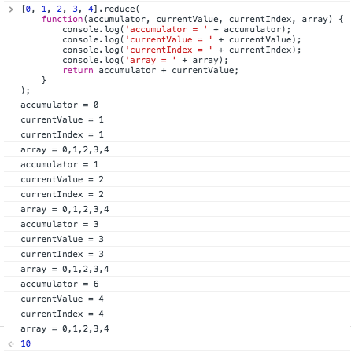

# Array.prototype.reduce()
reduce（）メソッドは、アキュムレータと配列内の各要素（左から右）に対して関数を適用して、単一の値に減らします。

## Syntax
```javascript
arr.reduce(callback, [initialValue])
```

### Parameters
#### callback
配列内の各要素に対して実行する関数で、4つの引数をとります。

*accumulator*

アキュムレータは、コールバックの戻り値を累積します。 これは、コールバックの最後の呼び出しで以前に返された累積値です。もし指定されていれば、initialValueです（下記参照）。

*currentValue*

現在の要素が配列内で処理されています。

*currentIndex*

配列内で処理されている現在の要素のインデックスです。 initialValueが指定されている場合はインデックス0から開始し、それ以外の場合はインデックス1から開始します。

*array*

配列reduceが呼び出されました。


#### initialValue
[オプション]コールバックの最初の呼び出しの最初の引数として使用する値。 初期値が指定されない場合、配列の最初の要素が使用されます。 空の配列で初期値を指定せずにreduceを呼び出すとエラーになります。

### Return value
削減された値。

## Description
reduceは、配列内の各要素に対してコールバック関数を1回実行します。これは、配列の穴を除いて、4つの引数を受け取ります。

- accumulator
- currentValue
- currentIndex
- array

コールバックが初めて呼び出されるとき、accumulatorとcurrentValueは2つの値のうちの1つになります。 reduceの呼び出しでinitialValueを指定すると、accumulatorはinitialValueと等しくなり、currentValueは配列の最初の値と等しくなります。 initialValueが指定されていない場合、accumulatorは配列の最初の値と等しくなり、currentValueは2番目の値と等しくなります。

> 注：initialValueが指定されていない場合、reduceは最初のインデックスをスキップしてインデックス1から開始するコールバック関数を実行します。 initialValueを指定すると、インデックス0から開始します。

配列が空でinitialValueが指定されていない場合は、TypeErrorがスローされます。 配列に要素が1つしかなく、initialValueが指定されていない場合、またはinitialValueが指定されても配列が空の場合、コールバックを呼び出さずにソロ値が返されます。

次の例に示すように、initialValueのない3つの可能な出力があるため、通常は初期値を指定する方が安全です。

### How reduce works
次のreduceの使用が発生したとします。

```javascript
[0, 1, 2, 3, 4].reduce(
  function (
    accumulator,
    currentValue,
    currentIndex,
    array
  ) {
    return accumulator + currentValue;
  }
);
```

コールバックは4回呼び出され、各コールの引数と戻り値は次のようになります。

