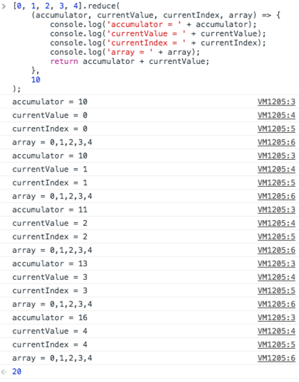
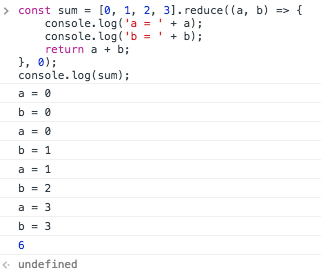
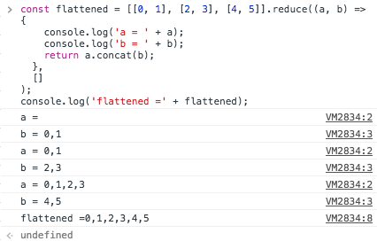
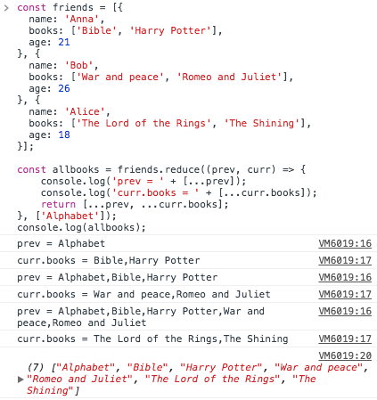

# Array.prototype.reduce()
reduce（）メソッドは、アキュムレータと配列内の各要素（左から右）に対して関数を適用して、単一の値に減らします。

## Syntax
```javascript
arr.reduce(callback, [initialValue])
```

### Parameters
#### callback
配列内の各要素に対して実行する関数で、4つの引数をとります。

*accumulator*

アキュムレータは、コールバックの戻り値を累積します。 これは、コールバックの最後の呼び出しで以前に返された累積値です。もし指定されていれば、initialValueです（下記参照）。

*currentValue*

現在の要素が配列内で処理されています。

*currentIndex*

配列内で処理されている現在の要素のインデックスです。 initialValueが指定されている場合はインデックス0から開始し、それ以外の場合はインデックス1から開始します。

*array*

配列reduceが呼び出されました。


#### initialValue
[オプション]コールバックの最初の呼び出しの最初の引数として使用する値。 初期値が指定されない場合、配列の最初の要素が使用されます。 空の配列で初期値を指定せずにreduceを呼び出すとエラーになります。

### Return value
削減された値。

## Description
reduceは、配列内の各要素に対してコールバック関数を1回実行します。これは、配列の穴を除いて、4つの引数を受け取ります。

- accumulator
- currentValue
- currentIndex
- array

コールバックが初めて呼び出されるとき、accumulatorとcurrentValueは2つの値のうちの1つになります。 reduceの呼び出しでinitialValueを指定すると、accumulatorはinitialValueと等しくなり、currentValueは配列の最初の値と等しくなります。 initialValueが指定されていない場合、accumulatorは配列の最初の値と等しくなり、currentValueは2番目の値と等しくなります。

> 注：initialValueが指定されていない場合、reduceは最初のインデックスをスキップしてインデックス1から開始するコールバック関数を実行します。 initialValueを指定すると、インデックス0から開始します。

配列が空でinitialValueが指定されていない場合は、TypeErrorがスローされます。 配列に要素が1つしかなく、initialValueが指定されていない場合、またはinitialValueが指定されても配列が空の場合、コールバックを呼び出さずにソロ値が返されます。

次の例に示すように、initialValueのない3つの可能な出力があるため、通常は初期値を指定する方が安全です。

### How reduce works
次のreduceの使用が発生したとします。

```javascript
[0, 1, 2, 3, 4].reduce(
  function (
    accumulator,
    currentValue,
    currentIndex,
    array
  ) {
    return accumulator + currentValue;
  }
);
```

コールバックは4回呼び出され、各コールの引数と戻り値は次のようになります。


reduceの第2引数として初期値を指定すると、結果は次のようになります。

```javascript
[0, 1, 2, 3, 4].reduce(
  (accumulator, currentValue, currentIndex, array) => {
    return accumulator + currentValue;
  },
  10
);
```



## Examples
### 配列のすべての値を合計する

```javascript
var sum = [0, 1, 2, 3].reduce(function (a, b) {
  return a + b;
}, 0);
// sum is 6
```



##　配列の配列を平坦化する

```javascript
var flattened = [[0, 1], [2, 3], [4, 5]].reduce(
  function(a, b) {
    return a.concat(b);
  },
  []
);
// flattened is [0, 1, 2, 3, 4, 5]
```



## オブジェクト内の値のインスタンスを数える

```javascript
var names = ['Alice', 'Bob', 'Tiff', 'Bruce', 'Alice'];

var countedNames = names.reduce(function (allNames, name) { 
  if (name in allNames) {
    allNames[name]++;
  }
  else {
    allNames[name] = 1;
  }
  return allNames;
}, {});
// countedNames is:
// { 'Alice': 2, 'Bob': 1, 'Tiff': 1, 'Bruce': 1 }
```

## スプレッド演算子とinitialValueを使用してオブジェクトの配列に含まれる配列を結合する

```javascript
// friends - an array of objects 
// where object field "books" - list of favorite books 
var friends = [{
  name: 'Anna',
  books: ['Bible', 'Harry Potter'],
  age: 21
}, {
  name: 'Bob',
  books: ['War and peace', 'Romeo and Juliet'],
  age: 26
}, {
  name: 'Alice',
  books: ['The Lord of the Rings', 'The Shining'],
  age: 18
}];

// allbooks - list which will contain all friends' books +  
// additional list contained in initialValue
var allbooks = friends.reduce(function(prev, curr) {
  return [...prev, ...curr.books];
}, ['Alphabet']);

// allbooks = [
//   'Alphabet', 'Bible', 'Harry Potter', 'War and peace', 
//   'Romeo and Juliet', 'The Lord of the Rings',
//   'The Shining'
// ]
```


------------------------------------------------------
## 15.4.4.21 Array.prototype.reduce ( callbackfn [ , initialValue ] ) 
[15.4.4.21](http://es5.github.io/#x15.4.4.21)

callbackfnは4つの引数を取る関数でなければなりません。 reduceは、関数として、配列に存在する各要素に対して1回、昇順でコールバックを呼び出します。


callbackfnは、previousValue（または以前のcallbackfn呼び出しの値）、currentValue（現在の要素の値）、currentIndex、およびトラバース対象の4つの引数を指定して呼び出されます。 コールバックが最初に呼び出されるとき、previousValueとcurrentValueは2つの値のうちの1つになります。 reduceの呼び出しでinitialValueが指定された場合、previousValueはinitialValueと等しくなり、currentValueは配列の最初の値と等しくなります。 initialValueが指定されなかった場合、previousValueは配列の最初の値と等しくなり、currentValueは2番目の値と等しくなります。 配列に要素がなく、initialValueが指定されていない場合は、TypeErrorです。

reduceはそれが呼び出されたオブジェクトに直接変更を加えませんが、callbackfnの呼び出しによってオブジェクトが変更される可能性があります。

reduceによって処理される要素の範囲は、callbackfnへの最初の呼び出しの前に設定されます。 reduceの呼び出しの後に配列に追加される要素は、callbackfnによってアクセスされません。 配列の既存の要素が変更された場合、callbackfnに渡された値は、reduceにアクセスするときの値になります。 reduceの呼び出しの後に削除され、訪問される前の要素は訪問されません。

1つまたは2つの引数を指定してreduceメソッドを呼び出すと、次の手順が実行されます。

1. この値を引数として渡すToObject呼び出しの結果をOとします。
2. lenValueを引数 "length"を持つOの内部メソッド[[Get]]を呼び出した結果としましょう。
3. lenをToUint32（lenValue）にします。
4. IsCallable（callbackfn）がfalseの場合は、TypeError例外をスローします。
5. lenが0でinitialValueが存在しない場合は、TypeError例外をスローします。
6. kを0とする。
7. initialValueが存在する場合、
    - アキュムレータをinitialValueに設定します。
8. それ以外の場合、initialValueは存在しません
    - kPresentを偽とする。
    - kPresentがfalseでk <lenの間に繰り返します。
        - PkをToString（k）とする。
        - kPresentを、引数PkでOの内部メソッド[[HasProperty]]を呼び出した結果とします。
        - kPresentが真であれば、
            - アキュムレータを引数Pkを持つOの内部メソッド[[Get]]を呼び出した結果とする。
        - kを1増やしてください。
    - kPresentがfalseの場合は、TypeError例外をスローします。
9. 繰り返し、k <len
    - PkをToString（k）とする。
    - kPresentを、引数PkでOの内部メソッド[[HasProperty]]を呼び出した結果とします。
    - kPresentが真であれば、
        - kValueを、引数PkでOの内部メソッド[[Get]]を呼び出した結果とします。
        - アキュムレータは、accumback、kValue、k、およびOを含むこの値と引数のリストとしてundefinedを指定してcallbackfnの[[Call]]内部メソッドを呼び出した結果にします。
    - kを1増やしてください。
10. アキュムレータを返す。

reduceメソッドのlengthプロパティは1です。

>NOTE

>reduce関数は意図的に汎用です。この値がArrayオブジェクトである必要はありません。したがって、メソッドとして使用するために他の種類のオブジェクトに転送することができます。 reduce関数をホストオブジェクトに正常に適用できるかどうかは、実装に依存します。


